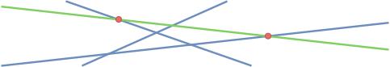

# IRQ - Intersection Range Querries

<div align="center">
<pre>
 ______      _______        ______  
|      \    |       \      /      \ 
 \▓▓▓▓▓▓    | ▓▓▓▓▓▓▓\    |  ▓▓▓▓▓▓\
  | ▓▓      | ▓▓__| ▓▓    | ▓▓  | ▓▓
  | ▓▓      | ▓▓    ▓▓    | ▓▓  | ▓▓
  | ▓▓      | ▓▓▓▓▓▓▓\    | ▓▓ _| ▓▓
 _| ▓▓_     | ▓▓  | ▓▓    | ▓▓/ \ ▓▓
|   ▓▓ \    | ▓▓  | ▓▓     \▓▓ ▓▓ ▓▓
 \▓▓▓▓▓▓     \▓▓   \▓▓      \▓▓▓▓▓▓\
                                \▓▓▓
- - - - - - - - - - - - - -
Intersection Range Querries
</pre>

[](https://opensource.org/licenses/MIT)

</div>

## Extreme Intersection Points

An extreme intersection point (eip) of a line is an outer intersection point, hence all other intersections lie on one side of the point.



The computation of all eip's is a key part of IRQ.

We have implemented a $\mathcal{O}(n\; \log^2\;n)$ algorithm.
To check correctness we can run the following command to get a visual interactive demo:
```sh
cargo run --bin eip-demo
```
Alternatively we can run `cargo test eip::tests::correctness -- --exact` to check correctness.
It creates multiple random instances, applies the algorithm and verifies the result by comparison to a simple $\mathcal{O}(n^2)$ brute-force approach.